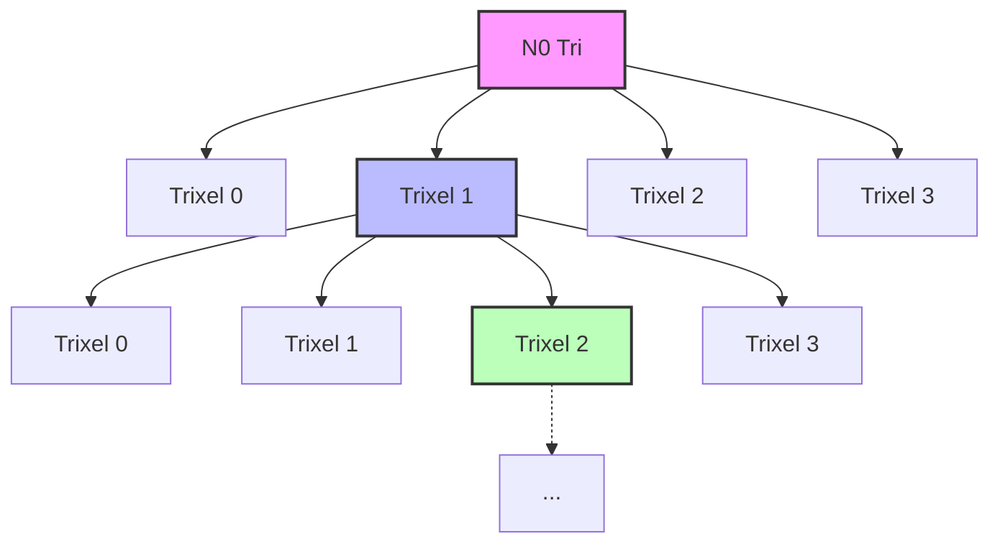
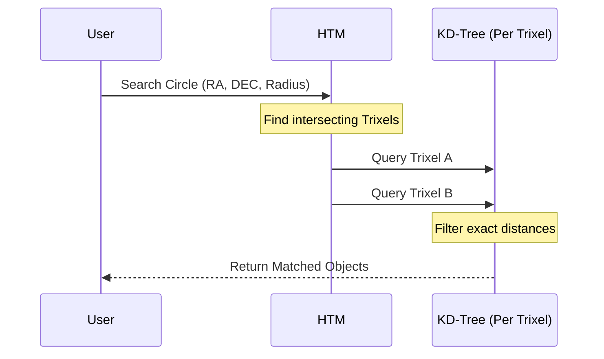
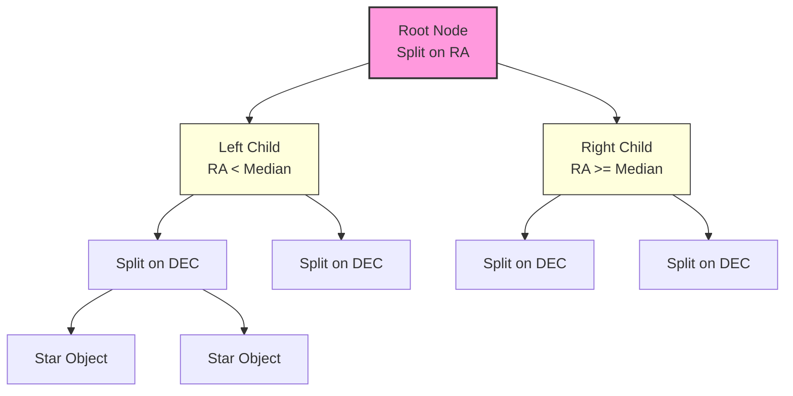
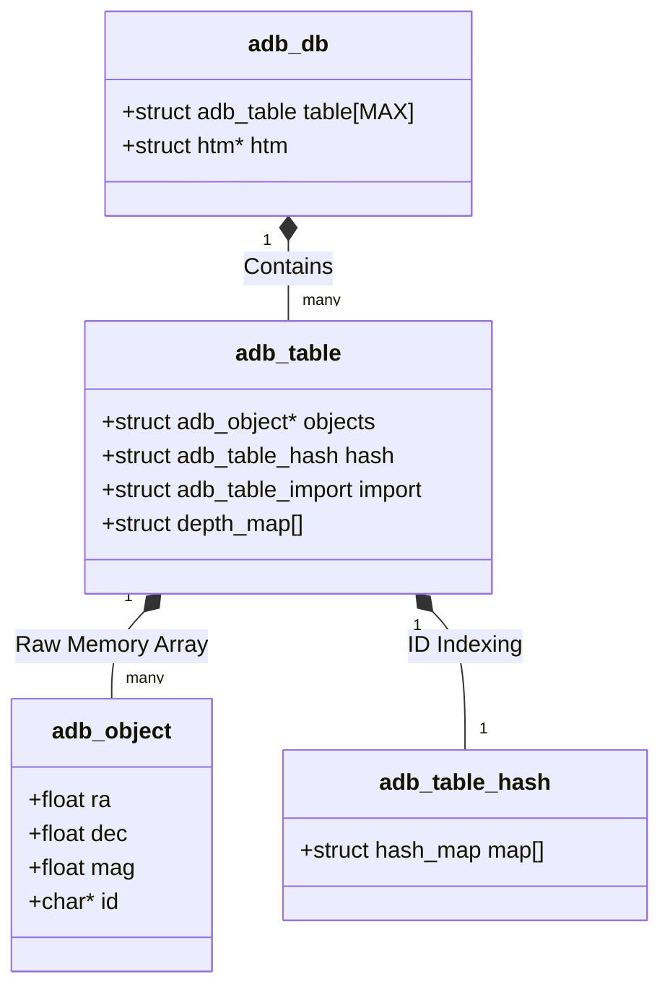
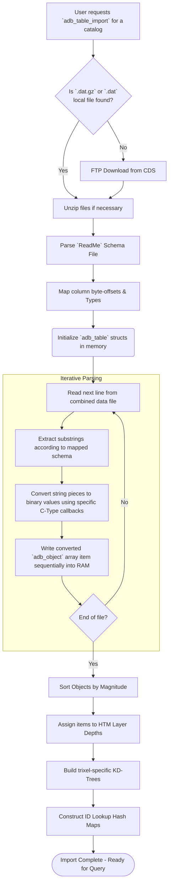
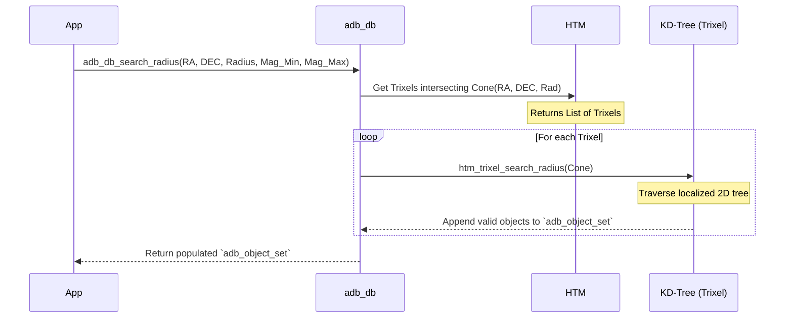
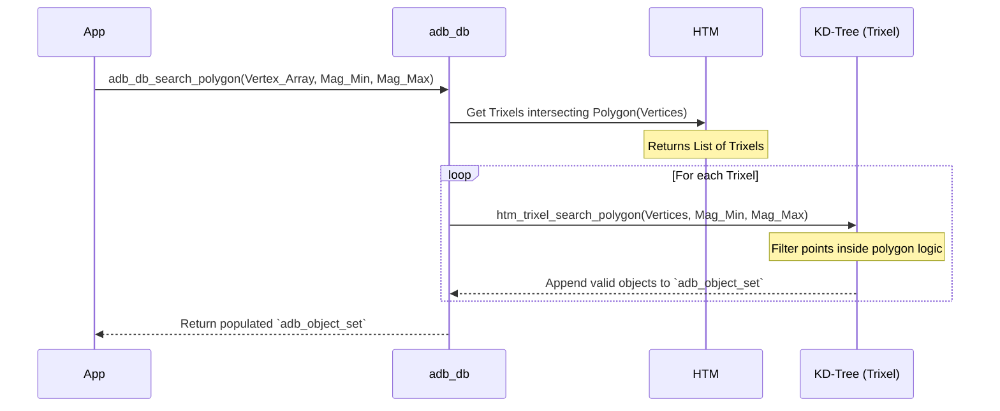
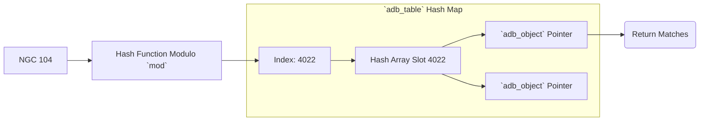
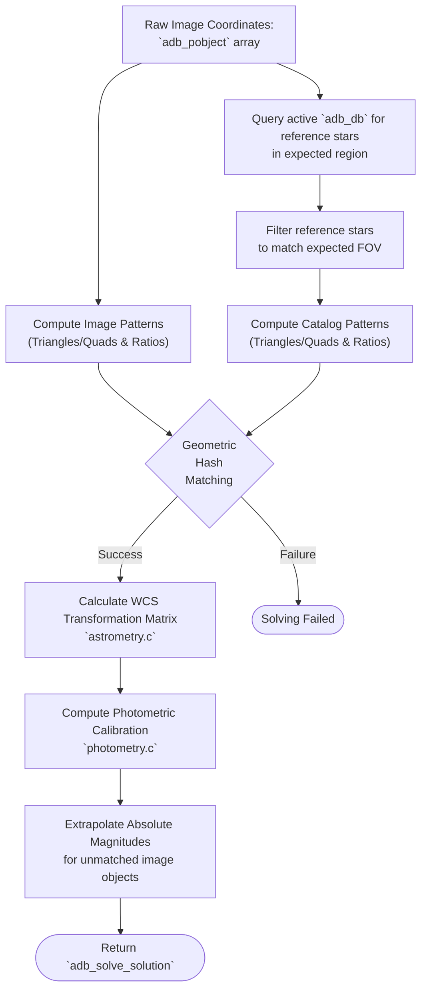
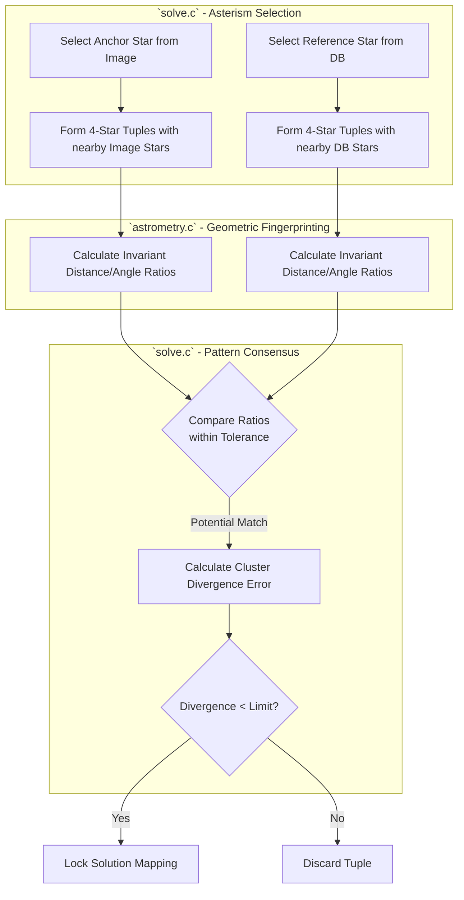

# libastrodb Architecture

This document provides a high-level overview of the `libastrodb` architectural design, focusing on the core mechanisms for data storage, importing, searching, and plate solving.

## 1. Data Storage

The data storage model is designed for high-performance spatial queries across the celestial sphere, leveraging hierarchical subdivisions and localized tree structures.

### Hierarchical Triangular Mesh (HTM)

The core structure for mapping the celestial sphere in `libastrodb` is the **Hierarchical Triangular Mesh (HTM)**. It provides a way to index the sphere's surface, turning complex 2D spatial intersection queries into fast 1D index tree traversals.

**How HTM Works:**
    1. **Level 0 (The Root):** The celestial sphere is first approximated by an octahedron, creating 8 initial equilateral spherical triangles (4 in the Northern Hemisphere, 4 in the Southern Hemisphere). These initial triangles are called "root trixels".
    2. **Recursive Subdivision:** To increase resolution, each trixel is subdivided into 4 smaller, roughly equal-area trixels by connecting the midpoints of its edges.
    3. **Depth/Level:** This subdivision process is repeated recursively. The number of times the subdivision is performed is called the "depth" or "level". Higher depths result in smaller trixels, providing finer spatial resolution.

By assigning a unique ID to each node in this tree structure, any given Right Ascension (RA) and Declination (DEC) coordinate on the sky can be rapidly localized into a specific trixel. Furthermore, when searching a circular region (like a telescope's field of view), the HTM logic can quickly determine which trixels are entirely inside, entirely outside, or intersecting the search boundary, drastically reducing the search space.

* **Magnitude-Based Depth Mapping:**
    Stars and celestial objects are distributed into specific HTM depths based on their apparent magnitude (brightness). Brighter objects are stored at shallower levels (representing larger sky areas), while fainter, more numerous objects populate deeper levels (smaller sky areas). This ensures that searches for bright guide stars across wide fields of view don't need to traverse the massive volume of faint background stars.

* **KD-Trees for Localized Searching:**
    While HTM efficiently finds the general region of the sky, iterating over every single star within a selected trixel to check its exact distance from the search center is slow. To solve this, `libastrodb` builds a KD-Tree (specifically a 2D tree using RA and DEC) for the objects *inside* each trixel.

    **How the KD-Tree Works:**
    1. **Splitting Space:** The objects inside the trixel are sorted. The algorithm finds the median position along one axis (e.g., Right Ascension) and splits the objects into two halves (left and right branches of a tree).
    2. **Alternating Axes:** In the next step down the tree, the two halves are each split again, but this time using the other axis (Declination). This alternating split continues until only one or a few objects remain in each "leaf" node.
    3. **Fast Filtering:** When a search falls within a trixel, the KD-Tree is traversed. At each branch, the algorithm checks if the search radius intersects the bounding box of that branch's remaining stars. If it doesn't, that entire branch (and all stars within it) is immediately discarded, avoiding thousands of unnecessary distance calculations.

* **Catalog Tables (`adb_table`):**
    Internal memory spaces mapped against well-known databases (e.g., Tycho-2, GSC, HyperLEDA). The application operates with an active database catalog context (`adb_db`) that manages the root HTM topology and provides memory pooling for these targeted tables.

    A single `adb_table` acts as the containerized boundary for all elements of a distinct imported catalog dataset. It centralizes references to that dataset's raw parsed C structs, string hash map indexes for fast lookup, HTM depth constraints, and file path URLs to coordinate FTP updates.

## 2. Data Import

The library features an integrated pipeline to dynamically process standardized astronomical data formats directly from internet repositories.

* **CDS File Acquisition (`cds_file.c`, `htm_get.c`):**
    Targeted catalogs are downloaded directly via FTP from the Centre de Données astronomiques de Strasbourg (CDS). The pipeline manages directory mirroring, fetching compressed `.dat.gz` datasets, and their respective `ReadMe` definition files. If a dataset is split into multiple parts, the files are downloaded and concatenated locally.
* **Dynamic Schema Parsing (`cds_parse.c`):**
    Instead of hardcoding memory offsets, the library parses the CDS `ReadMe` files at runtime. It searches for the "Byte-by-byte Description" table corresponding to the requested dataset. The parser identifies start and length byte offsets for the columns, detects data types (e.g., specific flags like 'F' for float, 'I' for int), mapping these to an internal `adb_ctype`.
* **Type Conversion and Ingestion (`import.c`):**
    During the text import phase, the system iterates over the uncompressed data file line-by-line. Instead of generic string handlers, specific optimized callback functions are executed based on the `adb_ctype` defined for each column.
  * *Example:* If a column is Right Ascension in hours/minutes/seconds, the callback `double_hms_hrs` extracts the string substring, converts it into a decimal float, and then normalizes it to a true radian mathematically in a single pass.
  * The results of these conversions are immediately written sequentially into pre-allocated memory pools representing arrays of native C `adb_object` structs.
* **Index Construction (`htm_import.c`, `hash.c`):**
    Once all raw components are loaded into continuous memory pools:
    1. **Sort:** Objects are sorted based on their magnitude/brightness limits against the boundaries established for different HTM depths.
    2. **Resolve Trixels:** Each object's spatial coordinates (RA, DEC) resolve its specific target trixel. The object reference is then attached to that trixel.
    3. **Build KD-Trees:** Once every object is attached to its respective localized trixel, `libastrodb` rapidly constructs the localized spatial 2D KD-trees prioritizing precise coordinate distances.
    4. **Generate Hashes:** Finally, independent string/integer hash map indexes are built connecting specific catalog designator strings back to the `adb_object` struct pointer for high-speed direct ID lookups.

## 3. Search Querying

Searching is optimized to interact seamlessly with the hierarchical constraints established during the storage and import phases. `libastrodb` supports several querying methods to extract `adb_object_set` result groupings.

### A. Radial (Cone) Search

A radial search (often called a cone search) asks the database to return all objects within a specific angular radius from a central Right Ascension and Declination pointer.

1. **HTM Intersection:** The search engine first converts the RA/DEC and radius into a 3D Cartesian vector cone. It tests this cone against the HTM index boundaries.
2. **Trixel Filtering:** Only the HTM trixels mathematically identified to be intersecting or residing entirely within the target cone geometry are loaded into the search context. This instantly rejects the vast majority of the database.
3. **Traversal and Magnitude Filtering:** The lookup process isolates objects matching the required magnitude spectrum boundaries, and then traverses the local KD-Tree of the active trixels to guarantee the extracted points strictly obey the requested spatial distances.

### B. Polygon Area Search

Similar to a radial search, a polygon search defines an arbitrary boundary on the celestial sphere using an array of 3 or more RA/DEC vertices. This is highly useful for querying the exact rectangular footprint of a camera sensor.

1. **Edge Testing:** The polygon search utilizes Great Circle geometry to test bounds. The HTM layer finds trixels that either sit inside the polygon or overlap its edges.
2. **KD-Tree Traversal:** During the KD-tree traversal of activated trixels, instead of a simple distance check (as in radial searches), the system uses a winding number algorithm (or similar point-in-polygon tests) adapted for spherical coordinates to confirm if a specific star resides inside the bounded array of vertices.

### C. Hash (String/ID) Search

Hash searches completely bypass spatial HTM boundaries, instead relying entirely on pre-computed fast-lookups matching string criteria (e.g., catalog designations like "NGC 104" or "HIP 92403").

1. **Precomputed Hashes:** During the import phase, specific "key" columns designated in the schema are run through a string hashing function. The resulting integer maps to an array index pointing directly to the object.
2. **Retrieval Search:** When a query targets a distinct alphanumeric string, the database hashes the query using the exact same modulo function, instantly jumping to the corresponding map array index slot and returning the associated `adb_object_set` pointers in $O(1)$ linear time, disregarding spatial distances.

## 4. Plate Solving

The astrometric plate solver bridges the gap between raw optical imagery and the known cataloged universe.

* **Coordinate Inputs:**
    Solving requires an array of unidentified target points extracted from an image (`adb_pobject`), containing raw planar (pixel X/Y) coordinates and relative brightness metrics. Simultaneously, the solver requires a baseline expectation of the stars in that area, retrieved from the `adb_db` via the search mechanisms outlined above (producing an `adb_object_set`).
* **Astrometric Matching (`solve.c` and `astrometry.c`):**
    The core of the solver relies on distance-independent geometric hashing. This process is broken down into identifying candidate subsets, extracting ratio-based fingerprints, and calculating divergence error:

1. **Tuple Generation (`solve.c`):** The algorithm sweeps through the brightest unassigned stars, selecting them as "anchors" (`try_object_as_primary`). Around these anchors, it groups neighboring stars into 4-star tuples (quads).
2. **Geometric Fingerprinting (`astrometry.c`):** The subsystem computes the geometric properties of these tuples—specifically, the internal distance ratios between the four stars. Because these ratios depend only on relative geometry, they remain constant (invariant) regardless of the camera's rotation angle or zoom scale, acting as spatial fingerprints.
3. **Hash Matching (`solve.c`):** The solver iteratively compares the invariant ratio fingerprints of the raw image tuples against those generated from the expected catalog.
4. **Divergence Assessment (`solve.c`):** When a fingerprint broadly aligns, `calc_cluster_divergence` calculates a strict, weighted standard error combining spatial offsets, magnitude deltas, and angle differences. If the divergence falls below acceptable tolerance thresholds, the match forms a verified mathematical correlation.

* **Transformation Generation:**
    Upon finding a statistically valid pattern lock, matrix mathematics calculates the actual positional translation. This creates a transformation mapping from 2D planar (pixel X/Y) space into absolute equatorial (Right Ascension and Declination) coordinate curves. This automatically accounts for camera focus scaling, rotation angles, and potentially lens distortion.
* **Photometric Calibration (`photometry.c`):**
    Once the astrometric positions are locked, the system analyzes the brightness levels. Using the definitively matched catalog stars as stable truth references, it compares their known catalog magnitudes against their corresponding raw image signal intensity. It resolves average instrumental zero-point shifts to account for atmospheric extinction limits or telescope exposure differences.
* **Solution Structure:**
    The final output is a fully resolved `adb_solve_solution` context. This context acts as a comprehensive translation layer, allowing any arbitrary pixel coordinate on the optical image to be instantly and accurately projected into the RA/DEC spherical coordinate system, alongside its calibrated apparent magnitude.
